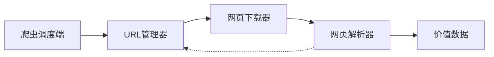
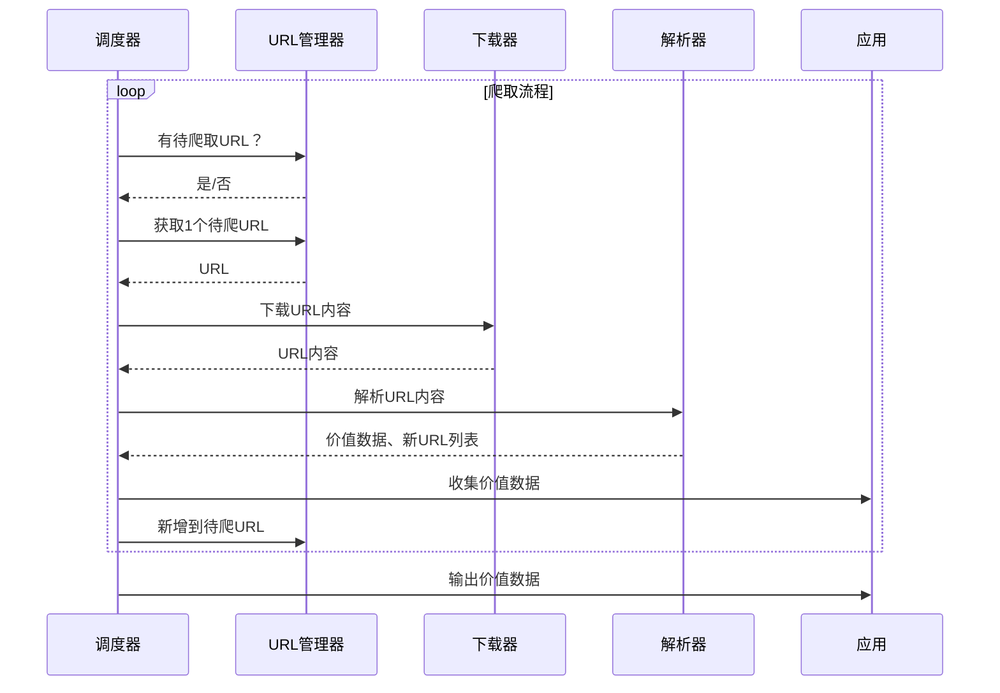

# 轻量级爬虫

#### 1、简单爬虫架构



#### 2、运行流程



#### 3、URL管理器

* 管理待抓取URL集合和已抓取URL集合，防止重复抓取、循环抓取。
* 实现方式：
  * 内存：Python内存；待爬取URL集合：set( )；已爬取URL集合：set( )
  * 关系数据库：MySQL；urls( url, is_crawled )
  * 缓存数据库：redis；待爬取URL集合：set；已爬取URL集合：set

#### 4、网页下载器

将互联网上URL对应的网页下载到本地的工具

* urllib2：Python官方基础模块
* requests：第三方包，更强大

##### urllib2方法：最简洁方法

```python
import urllib2

# 直接请求
response = urllib2.urlopen('http://www.baidu.com')
# 获取状态码，200成功
print response.getcode()
# 读取内容
cont = response.read()
```

##### urllib2方法：添加data、http header

```python
import urllib2

# 创建Request对象
request = urllib2.Request(url)
# 添加数据
request.add_data('a','1')
# 添加header
request.add_header('User-Agent','Mozilla/5.0')
# 发送请求获取结果
response = urllib2.urlopen(request)
```

##### urllib2方法：添加特殊情景的处理器

HTTPCookieProcessor、ProxyHandler、HTTPSHandler、HTTPRedirectHandler

```python
import urllib2, cookielib

# 创建cookie容器
cj = cookielib.CookieJar()
# 创建opener
opener = urllib2.build_opener(urllib2.HTTPCookieProcessor(cj))
# 安装opener
urllib2.install_opener(opener)
# 使用带有cookie的urllib2访问网页
response = urllib2.urlopen('http://www.baidu.com')
```

#### 5、网页解析器

从网页中提取有价值数据的工具

* 正则表达式
* html.parser
* BeautifulSoup
* lxml

##### 安装BeautifulSoup

```shell
pip install beautifulsoup4
```

##### 创建BeautifulSoup

```python
from bs4 import BeautifulSoup

# 根据HTML网页字符串创建BeautifulSoup对象
soup = BeautifulSoup(
                    html_doc,             # HTML文档字符串
                    'html.parser',        # HTML解析器
                    from_encoding='utf8'  # HTML文档的编码
                )
```

##### 搜索节点

```python
# 方法：find_all(name,attrs,string)

# 查找所有标签为a的节点
soup.find_all('a')
# 查找所有标签为a，链接符合/view/123.htm形式的节点
soup.find_all('a',href='/view/123.htm')
soup.find_all('a',href=re.compile(r'/view/\d+\.htm'))
# 查找所有标签为div，class为abc，文字为python的节点
soup.find_all('div',class_='abc',string='python')  # class记得加下划线
```

##### 访问节点信息

```python
# 得到节点：<a href='1.html'>Python</a>

# 获取查找到的节点的标签名称
node.name
# 获取查找到的a节点的href属性
node['href']
# 获取查找到的a节点的链接文字
node.get_text()
```

